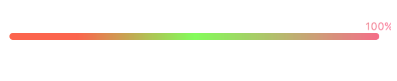

# GradientProgressBar

一个支持自定义渐变色的进度条控件，支持动画方式改变进度。



## 基本用法

将 GrandientProgressBar.h/.m 文件拖到你的项目。

可以在 IB 中初始化，也可以调用 initWithFrame: 方法。当需要动画显示时，可以这样：

```swift
self.gradientBar.percent = 1;
[_gradientBar beginAnimate];
        
```

也可以这样：

	[_gradientBar setPercent:1 animated:YES];
	
具体请参考 demo 中的 ViewController.m。

## 外观定制

具体请参考 GrandientProgressBar 类中暴露的属性。


